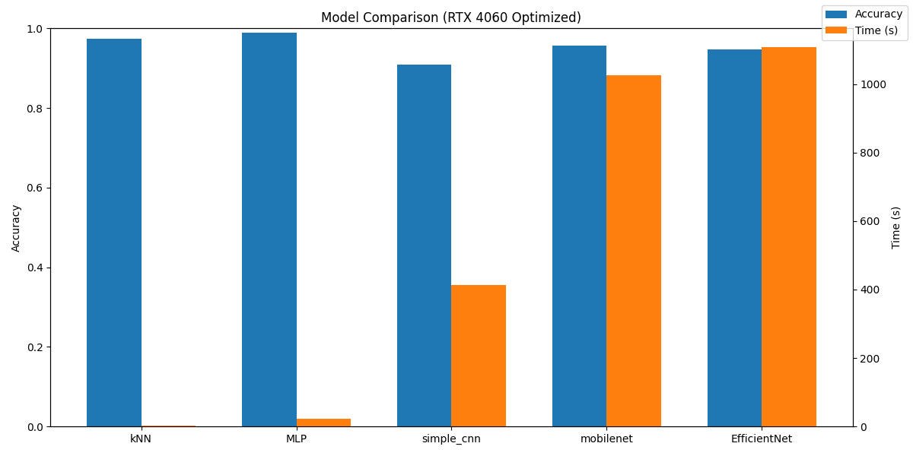
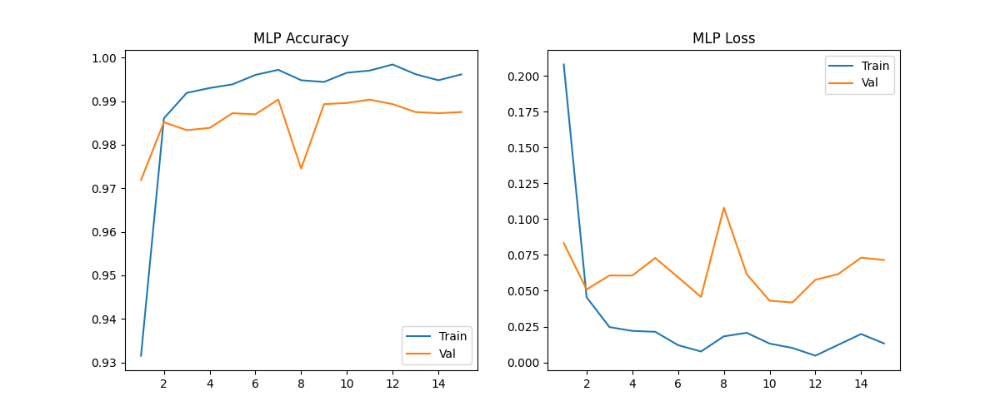
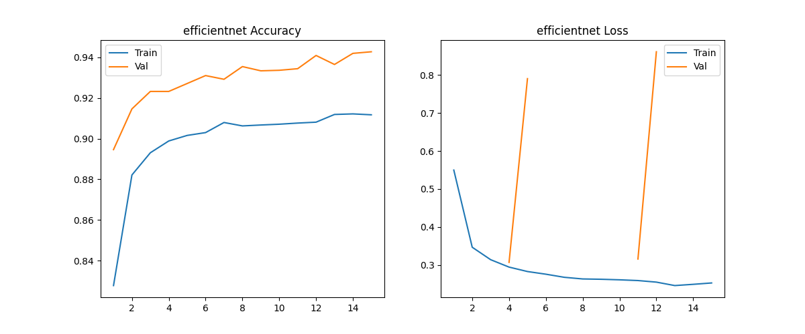
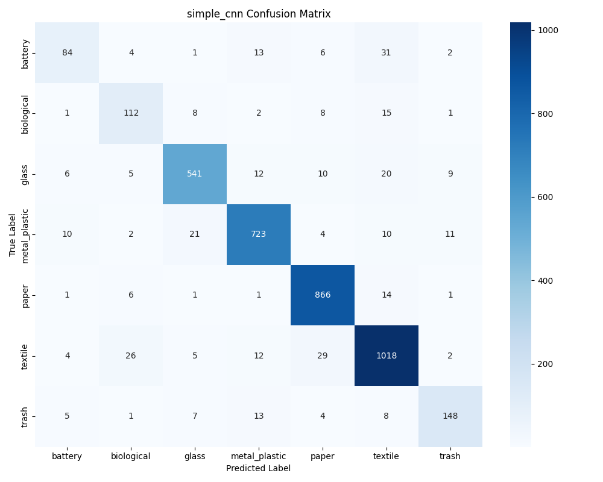
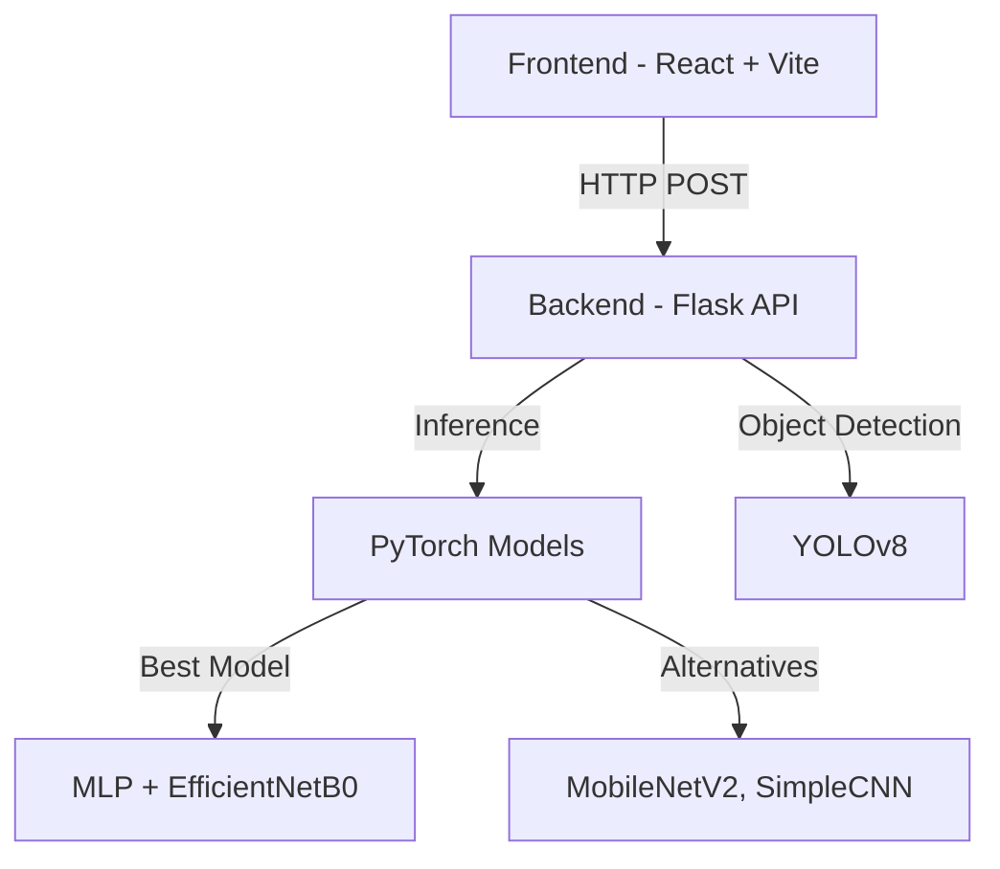
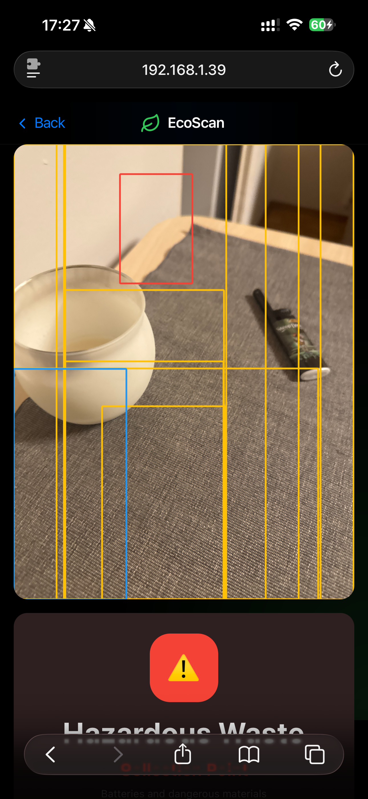
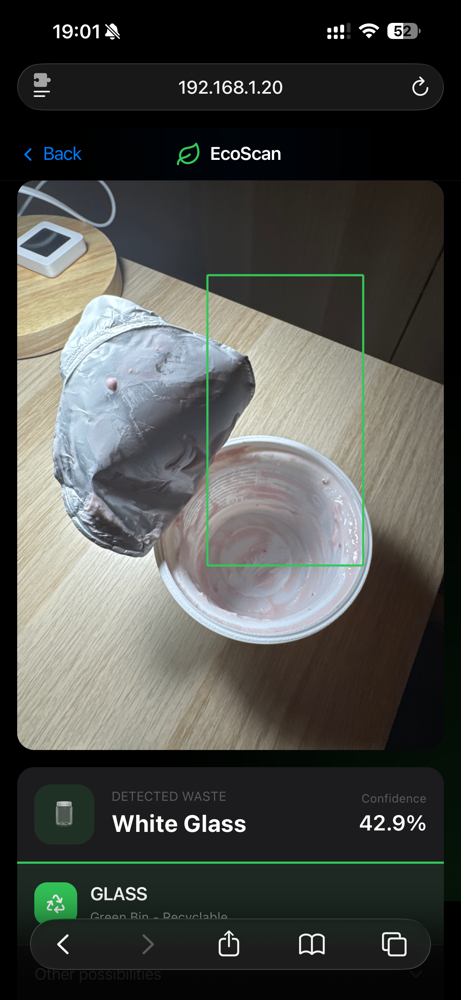
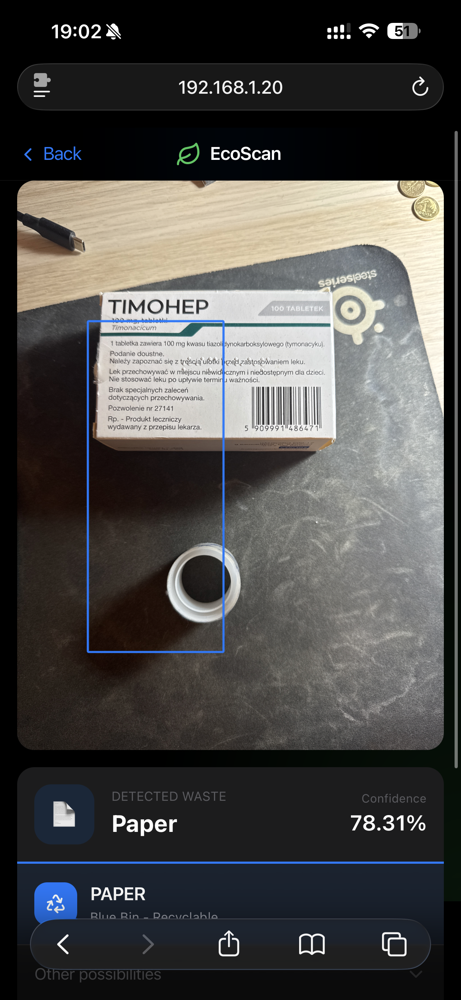
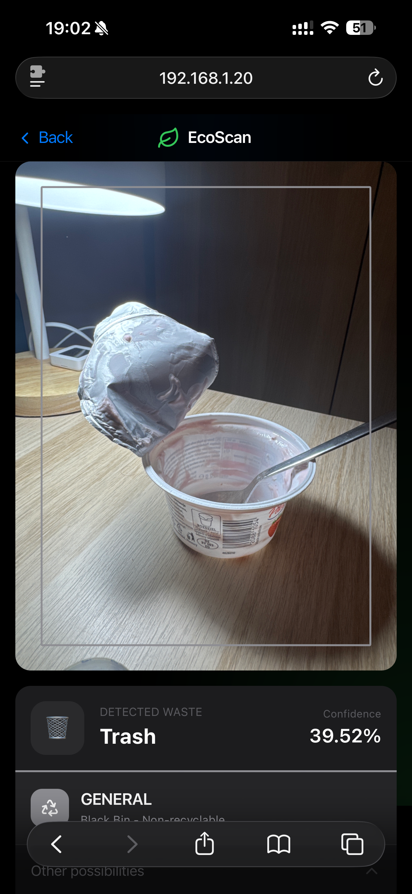

# Projekt Zaliczeniowy: Klasyfikacja Obrazów
**Autor:** Michał Przysiężny  
**Data:** Styczeń 2026  
**Przedmiot:** Inteligencja Obliczeniowa  

---

## 1. Opis Zadania

### 1.1 Cel Projektu
Moim celem było stworzenie **systemu do klasyfikacji odpadów**, który pomaga użytkownikom określić, do którego pojemnika należy wyrzucić daną rzecz. System składa się z dwóch głównych komponentów:

1. **Modele uczenia maszynowego** - porównanie różnych metod klasyfikacji obrazów (kNN, MLP, CNN, Transfer Learning)
2. **Aplikacja webowa** - intuicyjna aplikacja umożliwiająca przesłanie zdjęcia odpadu i otrzymanie rekomendacji, do którego kosza go wyrzucić

Projekt łączy w sobie aspekty teoretyczne (porównanie algorytmów) z praktycznym zastosowaniem (działająca aplikacja webowa), demonstrując pełny cykl rozwoju systemu AI - od treningu modeli po wdrożenie w aplikacji użytkowej.

### 1.2 Praktyczne Zastosowanie
Zaimplementowałem rozpoznawanie **7 kategorii odpadów**, które aplikacja automatycznie mapuje na odpowiednie pojemniki zgodnie z systemem segregacji:
- 🔵 **Papier** (niebieski) - papier, karton
- 🟡 **Metale i Tworzywa Sztuczne** (żółty) - plastik, metal
- 🟢 **Szkło** (zielony) - szkło
- 🟤 **Bio** (brązowy) - odpady organiczne
- ⚫ **Zmieszane** (czarny) - odpady nieposortowane, tekstylia
- 🔴 **Niebezpieczne** (czerwony) - baterie

> W projekcie kategorie `metal` i `plastic` są połączone w jedną klasę `metal_plastic`, mapowaną na żółty pojemnik.

### 1.3 Dataset
- **Źródło:** Połączyłem trzy zbiory: [**Garbage Classification (12 classes)**](https://www.kaggle.com/datasets/mostafaabla/garbage-classification) + [**Garbage Classification**](https://www.kaggle.com/datasets/hassnainzaidi/garbage-classification) + [**Garbage Classification**](https://www.kaggle.com/datasets/asdasdasasdas/garbage-classification)
- **Liczba obrazów:** 25,623 (po scaleniu)
- **Liczba klas:** 7 (uprościłem kategorie, aby pasowały do wszystkich datasetów)

| Klasa | Liczba obrazów | Opis |
|-------|----------------|------|
| **textile** | 7,302 | Ubrania, buty, tkaniny |
| **paper** | 5,929 | Papier, karton, tektura |
| **metal_plastic** | 5,202 | Metal, plastik (puszki, butelki) |
| **glass** | 4,015 | Szkło (białe, brązowe, zielone) |
| **trash** | 1,245 | Odpady zmieszane, śmieci ogólne |
| **biological** | 985 | Odpady organiczne |
| **battery** | 945 | Baterie |

### 1.4 Podział Danych
Zbiór scaliłem lokalnie w folderze `merged_dataset`, a następnie podzieliłem dynamicznie:
- **Treningowy:** ~70%
- **Walidacyjny:** ~15%
- **Testowy:** ~15%

### 1.5 Struktura Projektu
```text
.
├── backend/
│   ├── app.py                       # Główny serwer aplikacji (Flask)
│   ├── download_and_merge.py        # Skrypt pobierający i scalający dane
│   ├── train_comparison_pytorch.py  # Główny skrypt trenujący modele
│   ├── comparison_results_pytorch/  # Folder z wynikami treningu (wykresy, modele .pth)
│   ├── class_names.json             # Mapowanie nazw klas
│   └── resources/                   # Dodatkowe pliki
├── frontend/                        # Kod źródłowy aplikacji klienckiej (React + Vite)
├── resources/                       # Obrazy użyte w dokumentacji
├── requirements.txt                 # Lista zależności Python
└── README.md                        # Dokumentacja projektu
```

---

## 2. Preprocessing

### 2.1 Transformacje Obrazów (PyTorch)

**Trening (z augmentacją):**
```python
transforms.Compose([
    transforms.RandomResizedCrop(224, scale=(0.8, 1.0)),
    transforms.RandomHorizontalFlip(),
    transforms.ToTensor(),
    transforms.Normalize([0.485, 0.456, 0.406], [0.229, 0.224, 0.225])
])
```

**Walidacja/Test (deterministyczne):**
```python
transforms.Compose([
    transforms.Resize((224, 224)),
    transforms.CenterCrop(224),
    transforms.ToTensor(),
    transforms.Normalize([0.485, 0.456, 0.406], [0.229, 0.224, 0.225])
])
```

### 2.2 Optymalizacje GPU (RTX 4060)
W celu optymalizacji treningu wykorzystałem:
- **AMP (Automatic Mixed Precision)** - przyspieszenie obliczeń
- **TF32** - szybsze mnożenie macierzy
- **channels_last** - optymalny format pamięci dla CNN
- **cudnn.benchmark** - optymalizacja dla stałych rozmiarów wejść

---

## 3. Architektura Modeli

### 3.1 Simple CNN (trenowana od zera)
```
Input (224×224×3)
    ↓
Conv2D(32, 3×3) + ReLU + MaxPool(2×2)
    ↓
Conv2D(64, 3×3) + ReLU + MaxPool(2×2)
    ↓
Conv2D(128, 3×3) + ReLU + MaxPool(2×2)
    ↓
Flatten → Dropout(0.25) → Dense(256) → ReLU
    ↓
Dropout(0.25) → Dense(7)
```

### 3.2 Transfer Learning (MobileNetV2 / EfficientNetB0)
```
Input (224×224×3)
    ↓
[Pre-trained Backbone - FROZEN]
    ↓
Custom Classifier Head → Dense(7)
```
- Backbone zamrożony (frozen) - uczony tylko classifier
- Wagi z ImageNet

### 3.3 kNN (k-Nearest Neighbors)
- **Ekstrakcja cech:** EfficientNetB0 (1280-wymiarowy wektor)
- **Standaryzacja:** StandardScaler
- **k = 5**, metryka: euklidesowa

### 3.4 MLP (Multi-Layer Perceptron)
```
Input: 1280 features (z EfficientNetB0)
    ↓
Dense(512) + ReLU + Dropout(0.2)
    ↓
Dense(256) + ReLU + Dropout(0.2)
    ↓
Dense(7)
```

---

## 4. Wyniki Eksperymentów

### 4.1 Porównanie Dokładności

Dzięki zastosowaniu znacznie większego zbioru danych oraz uproszczeniu klas (np. połączenie `metal` i `plastic`), wyniki uległy znaczącej poprawie:

| Model | Val Accuracy | **Test Accuracy** | Czas Treningu |
|-------|--------------|-------------------|---------------|
| **MLP** | 99.04% | **98.91%** | 22s |
| kNN (k=5) | - | 97.37% | 4s |
| MobileNetV2 | 95.11% | 95.76% | 17min 6s |
| EfficientNetB0 | 94.28% | 94.64% | 18min 27s |
| Simple CNN | 91.28% | 90.84% | 6min 53s |

### 4.2 Krzywe Uczenia



#### MLP - Training Curves


#### EfficientNetB0 - Training Curves


### 4.3 Macierze Pomyłek

> [!NOTE]
> Macierz pomyłek dla MLP **nie została wygenerowana w moim pipeline**, ponieważ model jest trenowany na pre-extracted features (nie end-to-end). Można ją jednak łatwo policzyć na zbiorze testowym z predykcji MLP. Poniżej przedstawiono macierze dla modeli CNN.

#### EfficientNetB0


#### MobileNetV2


#### SimpleCNN


---

## 5. Analiza Wyników

### 5.1 Najlepszy Model
**MLP na cechach EfficientNetB0** osiąga **98.91% dokładności**. Jest to wynik bardzo wysoki, jednak w praktycznych testach zauważyłem, że model często zwraca **100% pewności**, co może sugerować zjawisko **przeuczenia (overfitting)**.

Aby rozwiązać ten problem, wdrożyłem mechanizm **Ensemble Voting (Głosowanie Zespołowe)**. Ostateczna decyzja podejmowana jest na podstawie głosów 4 modeli (MLP, EfficientNetB0, MobileNetV2, SimpleCNN).

**Mechanizm Głosowania:**
- Każdy model oddaje głos na swoją przewidywaną klasę.
- Dla każdej klasy obliczam **score = liczba_głosów + średnia_pewność**, gdzie średnia pewność to średnia confidence modeli głosujących za tą klasą.
- Wygrywa klasa z najwyższym score - w praktyce oznacza to, że priorytet ma liczba głosów, a przy remisie decyduje średnia pewność.

Dzięki temu, nawet jeśli MLP jest zbyt pewny siebie, pozostałe modele mogą skorygować wynik, co znacząco zwiększa niezawodność systemu w rzeczywistych warunkach.

### 5.2 Wpływ Uproszczenia Klas
Decyzja o scaleniu podobnych kategorii (np. `paper` + `cardboard`, `metal` + `plastic`) była strzałem w dziesiątkę.
- **SimpleCNN** poprawił wynik z 77% na **90.84%**.
- Modele deep learning (MobileNet, EfficientNet) osiągają stabilne >94%.
- Problem mylenia "szkła białego" ze "szkłem zielonym" zniknął całkowicie dzięki temu posunięciu.

### 5.3 Transfer Learning vs Trening od Zera
Nawet prosta sieć CNN (SimpleCNN) radzi sobie teraz bardzo dobrze (>90%), co sugeruje, że dataset jest wystarczająco duży i zróżnicowany, by uczyć się cech od zera. Jednak Transfer Learning nadal zapewnia szybszą konwergencję i wyższą ostateczną dokładność.

---

## 6. Aplikacja Webowa

### 6.1 Architektura Systemu

System składa się z kilku głównych komponentów:



**Backend (Flask + PyTorch):**
RESTful API obsługujące modele klasyfikacji oraz detekcję obiektów (YOLOv8).

**Frontend (React):**
Intuicyjny interfejs umożliwiający przesyłanie zdjęć, wizualizację wyników klasyfikacji oraz porównanie predykcji różnych modeli.

### 6.2 Funkcjonalności Aplikacji

Aplikacja umożliwia łatwe przesyłanie zdjęć, automatyczne rozpoznawanie odpadów i wskazywanie odpowiedniego kosza. Dodatkowo oferuje detekcję obiektów oraz szczegółowe porównanie wyników klasyfikacji wszystkich dostępnych modeli.

#### Strategia i Ograniczenia (Szczerze o YOLO)
Postawiłem na **rozwiązanie hybrydowe**: system **zawsze próbuje** wyciąć obiekt przez YOLO (z niskim progiem `conf=0.15`), ale gdy YOLO nic nie znajdzie, przechodzi na wycinanie środka zdjęcia (center crop).

**Czemu tylko jeden obiekt?**
Bardzo chciałem zrobić wykrywanie wielu śmieci na raz, ale YOLO strasznie mi tu bruździło i ostatecznie się wycofałem do jednego głównego obiektu.

Miałem z tym niezły mętlik:
1.  Jak dałem **niski próg pewności**, to model wariował i widział śmieci w każdym cieniu (szum).
2.  Jak dałem **wysoki próg**, to z kolei robił się ślepy na inne obiekty – na zdjęciu były trzy butelki, a on widział jedną.

Nie udało mi się znaleźć złotego środka, więc dla stabilności aplikacji zostałem przy wersji "jeden główny obiekt".

### 6.3 API Endpoints

#### `GET /health`
Sprawdza status serwera i załadowanych modeli.

**Response:**
```json
{
  "ok": true,
  "device": "cuda",
  "models": ["MLP", "SimpleCNN", "MobileNetV2", "EfficientNetB0"],
  "classes": ["battery", "biological", ...]
}
```

#### `GET /models`
Zwraca listę wszystkich załadowanych modeli dostępnych do predykcji.

**Response:**
```json
{
  "models": ["SimpleCNN", "MobileNetV2", "EfficientNetB0", "MLP"]
}
```

#### `POST /predict`
Główny endpoint klasyfikacji. Domyślnie używa **ensemble (majority voting)** 4 modeli, a w razie braku części modeli przechodzi na fallback MLP.

**Request:**
- `Content-Type: multipart/form-data`
- `file`: plik obrazu (JPG, PNG, WEBP)

**Response:**
```json
{
  "detections": [{
    "box": [x1, y1, x2, y2],
    "box_norm": [0.1, 0.2, 0.8, 0.9],
    "class": "metal_plastic",
    "confidence": 98.5,
    "bin": "PLASTIC",
    "binColor": "#FFC107",
    "method": "yolo"
  }]
}
```

> Pole `method` przyjmuje wartości: `yolo`, `full`, `center_90`, `center_75`, `center_60` (w zależności od wybranego cropa).

#### `POST /predict_all`
Porównanie wszystkich modeli na tym samym obrazie. Może zwrócić do **3 detekcji** (najlepsze bounding boxy z YOLO).

**Response:**
```json
{
  "detections": [{
    "box": [x1, y1, x2, y2],
    "comparison": {
      "MLP": [{"class": "metal_plastic", "confidence": 98.5}, ...],
      "EfficientNetB0": [{"class": "metal_plastic", "confidence": 96.2}, ...],
      "MobileNetV2": [{"class": "metal_plastic", "confidence": 94.8}, ...],
      "SimpleCNN": [{"class": "metal_plastic", "confidence": 65.3}, ...]
    }
  }]
}
```

### 6.4 Interfejs i Optymalizacja
Interfejs użytkownika jest przejrzysty. Wyniki prezentowane są jako **bounding box** na zdjęciu z czytelnym wskazaniem klasy i koloru kosza.

Moim priorytetem było, żeby to po prostu **szybko działało**:
- Wykorzystałem GPU (CUDA), żeby nie czekać wieki na wynik.
- Modele ładuję raz przy starcie, więc potem predykcja jest błyskawiczna.
- Dodałem proste sprawdzanie błędów, żeby aplikacja nie "wybuchała" po wrzuceniu złego pliku.

---

## 7. Problemy i Ewolucja Detekcji (YOLO)

W trakcie prac nad integracją modelu detekcji obiektów (YOLOv8) napotkałem szereg problemów związanych z kalibracją parametrów (confidence threshold, IOU, crop size).

### 7.1 Nadmierna Czułość
Model był zbyt czuły i wykrywał "śmieci" nawet tam, gdzie ich nie było. Zamiast jednego obiektu, widział ich dziesiątki, zaznaczając każdy drobny szczegół w tle jako osobny przedmiot.


### 7.2 Fragmentaryczne Kadrowanie
Wcześniejsze wersje algorytmu kadrowania miały problem z poprawnym objęciem całego przedmiotu, często wycinając jedynie fragment (np. samą etykietę zamiast całej butelki).



### 7.3 Zbyt Szerokie Ramki
W innej konfiguracji model generował ramki, które były zbyt luźne, obejmując zbyt dużo tła, co negatywnie wpływało na późniejszą klasyfikację przez sieć neuronową.


### 7.4 Rozwiązanie: Algorytm Hybrydowy
Aby wyeliminować te problemy, w kodzie (plik `backend/app.py`) zastosowałem **połączenie dwóch podejść**:
1. **YOLO (Object Detection):** System zawsze próbuje wykryć obiekt za pomocą YOLO z niskim progiem pewności (`conf=0.15`), preferując klasy COCO takie jak butelki, kubki, miski itp. Jeśli obiekt zostanie wykryty, wycinany jest z paddingiem 20px i używany do klasyfikacji.
2. **Crop Pyramid (Detekcja Fallback):** Jeśli YOLO nie wykryje żadnego obiektu, system automatycznie przełącza się na **wycinanie środka zdjęcia** (center crop) w kilku skalach (90%, 75%, 60%).
3. **Wybór najlepszego cropa:** Spośród wszystkich kandydatów (YOLO crop + full image, lub pyramid crops) wybierany jest ten, który daje najwyższą pewność klasyfikacji MLP (z bonusem 10% dla YOLO crop).

Dzięki temu system maksymalizuje szansę na wykrycie obiektu przez YOLO, ale ma solidny fallback gdy YOLO nie widzi niczego.

---

## 8. Wnioski

Projekt wykazał, że **jakość i ilość danych** (scalenie 3 zbiorów do ~25k obrazów) jest kluczowa dla sukcesu modelu. Uproszczenie klasyfikacji do 7 uniwersalnych kategorii pozwoliło osiągnąć **~99% dokładności**.

Najskuteczniejszą strategią okazało się połączenie **EfficientNet Features + MLP**, które jest szybkie i precyzyjne. Wdrożenie **Ensemble Voting** rozwiązało problem nadmiernej pewności siebie pojedynczego modelu.

**Wyzwania i Ograniczenia:**
System **nie jest jeszcze doskonały**. Głównym problemem pozostaje trudność w znalezieniu wysokiej jakości datasetu, który w pełni odzwierciedlałby rzeczywiste zdjęcia robione przez użytkowników (różne tła, oświetlenie, deformacje śmieci). Dostępne zbiory są często zbyt "sterylne", co czasem prowadzi do błędnych identyfikacji w warunkach domowych. Dodatkowym wyzwaniem jest wspomniana wcześniej detekcja wielu obiektów jednocześnie.

---

## 9. Technologie

- **Framework:** PyTorch 2.x + torchvision
- **Backend:** Flask (REST API)
- **Frontend:** React + Vite
- **ML:** scikit-learn, NumPy, Matplotlib
- **CV:** YOLOv8 (Ultralytics), PIL
- **GPU:** NVIDIA RTX 4060 (CUDA 12.4)

---

## 10. Podsumowanie

Projekt łączy teorię z praktyką, prezentując ewolucję od prostego klasyfikatora do systemu opartego na **~25,000 obrazów**. Mimo wysokich wyników laboratoryjnych, projekt obnażył również wyzwania związane z wdrażaniem AI w rzeczywistości.

✅ **Integracja Danych** - Scalenie 3 datasetów pozwoliło zbudować solidną bazę treningową.
✅ **Eksperymenty ML** - Wykazałem, że prosty MLP na cechach EfficientNet (98.9%) działa lepiej niż trenowanie CNN od zera (90.8%).
✅ **Optymalizacja** - Skuteczne wykorzystanie GPU i technik preprocessingowych.
⚠️ **Weryfikacja Rzeczywista** - Mimo 99% dokładności na zbiorze testowym, aplikacja w codziennym użytku bywa omylna, co wynika ze specyfiki "sterylnych" danych treningowych vs. zaszumionych zdjęć użytkowników.

**Wnioski Końcowe:**
Projekt udowadnia, że wysoki wynik w metrykach (`val_acc`) nie zawsze przekłada się na idealne działanie w produkcji. Kluczem do dalszego rozwoju nie jest lepszy algorytm, ale **lepsze, bardziej zróżnicowane dane** (zdjęcia "z ręki", różne tła). Aplikacja stanowi solidny fundament, ale wymaga dalszej pracy nad robustnością.

---

## 11. Instrukcja Uruchomienia

### 1. Wymagania
- Python 3.10+
- Zalecana karta graficzna NVIDIA (dla treningu)

### 2. Instalacja Zależności
```bash
pip install -r requirements.txt
```

### 3. Przygotowanie Danych (Kluczowy Krok)
Skrypt pobierze 3 datasety z Kaggle, scali je i utworzy strukturę katalogów w folderze `merged_dataset`:
```bash
python backend/download_and_merge.py
```

### 4. Trening Modeli
Uruchomienie skryptu treningowego (wygeneruje wyniki w `backend/comparison_results_pytorch`):
```bash
python backend/train_comparison_pytorch.py
```

### 5. Uruchomienie Aplikacji
Start serwera Flask:
```bash
python backend/app.py
```

oraz aplikacji webowej

```bash
cd frontend
npm install
npm run dev
```

Aplikacja będzie dostępna pod adresem: `http://localhost:5002` (backend) oraz `http://localhost:5173` (frontend)
